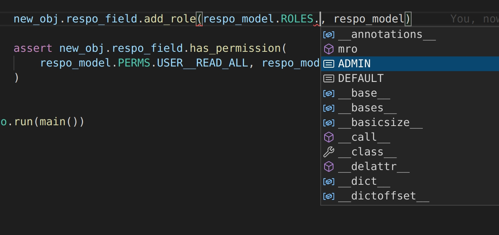

# Respo

_respo_ states for resource policy and is tiny, user friendly tool for building RBAC systems based on static `yml` file, mainly with FastAPI framework in mind. In most cases – for even large set of roles – single file would be enough to provide restricting system access.

Features:

- It provides custom fields for **SQLAlchemy** and **Django** to store users roles in database.

- Implements R. Sandhu Role-based access control [text](https://profsandhu.com/articles/advcom/adv_comp_rbac.pdf).

- Dead simple, fast and can be trusted – 100% coverage.

- **No issues** with mutlithreading and multiprocessing – you just pass around already prepared, compiled respo_model (from file) in your app that is **readonly**.

- Generates your roles, permissions offline and compile it to pickle file for superfast access in app.

- Detailed documentation and very detailed error messages in CLI command.

- 100% autocompletion and typing support with optional code generation for even better typing support.

---

_Note, every piece of code in the docs is a tested python/yml file, feel free to use it._

## 1. Declaring YML file with permissions, roles.

```yml
{!./examples/index/respo_example.yml!}
```

There are 3 sections:

- **permissions**, list of double labels `"{collection}.{label}"`, they represent single permission that user can be given.
- **principles**, list of principles where one can declare rules for permissions to contain others. For example, we want to some one that (through some role) have "more powerful" permission `user.read_all` to also have access to resources that require `user.read_basic` permission.
- **roles**, list of roles objects, note that they have unique `name`, set of `permissions` and optional list `include` of other roles, so we can give admin role the same set of rules as default user (and add more powerful ones).

## 2. Parse YML file to readonly pickle using respo CLI interface.

Thanks to [Click](https://click.palletsprojects.com/), _respo_ has powerful cli interface.

```console
{!./examples/index/respo_cli.sh!}
```

That powerful command create serveral of things:

- `.respo_cache/__auto__respo_model.bin` file (pickle format of model).

- `.respo_cache/__auto__respo_model.yml` file (yml format of model).

- `respo_model.py` file (python file of model for better autocompletion).

(_Refer to User Guide for more information about first two of them._)

**respo_model.py**

Autogenerated file with class based on respo.RespoModel with bonus autocompletion.

```python
{!./examples/index/respo_model.py!}
```

## 3. Usage in FastAPI and saving respo client to database.

To interact with stateless, readonly respo_model created above, respo provides abstraction called `RespoClient` that can be stored in database, be given or removed a role that can also check using respo_model instance its permissions.

```python
{!./examples/index/respo_client_example.py!}
```

From this point its only matter of short implementation to have something in this manner which is the goal. Single endpoint must have single permission for it, and thanks to respo compilation step, every "stronger" permissions and roles would include "weaker" so **we don't need to have ifology**.

```python
from .dependencies import user_have_permission

...

@user_have_permission("users.read_all")
router.get("/users/read_all/")
def users_read_all(user = Depends(get_user)):
    return user

```

Note, thanks to smart types in RespoField for SQLAlchemy and auto generated typed file `respo_model` we have powerful autocompletions:




